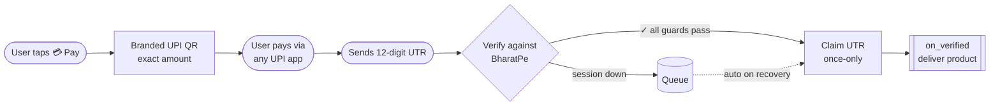

<div align="center">


# BharatpePG

### Drop-in UPI payments for any Telegram bot — pay by QR, verify by UTR, deliver automatically.

[](https://www.python.org)
[](https://python-telegram-bot.org)
[](#)
[](LICENSE)


</div>

---

> [!WARNING]
> **Unofficial integration — read first.** This talks to **private BharatPe endpoints** (the ones the enterprise dashboard uses). There is no public BharatPe API, so endpoints can change without notice — which is why every host here is **configurable, not hard-coded**. Use it **only with your own KYC-verified merchant account**, and comply with BharatPe's terms.

---

## ✨ What it does

A customer pays the exact amount by scanning a branded QR, sends you the 12-digit **UTR**, and the bot verifies it against **your own BharatPe account** — then runs your delivery logic automatically. No payment gateway, no 2% fee, no website.

<div align="center">

| 💳 **Collect** | 🔐 **Verify** | 📦 **Deliver** |
|:---:|:---:|:---:|
| Branded UPI QR for the exact amount | 5 safety guards + reuse protection | `on_verified` hook fires once per sale |

</div>

### 🚀 Feature highlights

- 🧾 **`/pay` flow** — amount picker → professional QR card → UTR submission → verified
- 🔑 **`/login` (OTP)** — authenticate your BharatPe session from your phone; merchant ID auto-discovered
- 🧮 **`verify_utr()`** — standalone one-call verification for your own custom UI
- 🪝 **`on_verified` hook** — deliver files, group invites, license keys, or **credits** — automatically
- 🛡️ **Outage-safe** — background health monitor, new payments paused while down, in-flight UTRs **queued and auto-delivered on recovery**
- 🗄️ **Zero-setup storage** — stdlib SQLite by default; Postgres is one env var
- ⌨️ **Inline + reply keyboards** — both, out of the box
- ☁️ **Deploy anywhere** — Railway, Render, or a plain VPS

---

## 📦 Installation

```bash
pip install bharatpe-pg
```

<details>
<summary>Postgres instead of the default SQLite file</summary>

```bash
pip install "bharatpe-pg[postgres]"
```
</details>

> Not yet on PyPI? Install from source: `pip install git+https://github.com/AshuXD-X/bharatpe-payment-plugin`

---

## ⚡ Quickstart

Add it to any `python-telegram-bot` app with **three calls** — your own handlers stay untouched:

```python
from telegram.ext import Application
from bharatpe_pg import PaymentConfig, init_db, register_payment_handlers, register_admin_handlers

cfg = PaymentConfig(
    upi_id        = "yourname@yesbankltd",
    merchant_name = "My Store",
    admin_ids     = [123456789],          # your Telegram user ID
    # merchant_id is optional — auto-discovered when the admin runs /login
)

app = Application.builder().token("BOT_TOKEN").build()
init_db(cfg)                              # SQLite file store — no DB server needed
register_payment_handlers(app, cfg)       # /pay flow
register_admin_handlers(app, cfg)         # /login + /admin
app.run_polling()
```

🏃 **Runnable examples:** [`examples/minimal_bot.py`](examples/minimal_bot.py) · [`examples/credits_bot.py`](examples/credits_bot.py)

---

## 🔄 How it works



---

## 🔑 The `/login` OTP flow

BharatPe login is **phone + OTP** (no password). An admin runs it once:

1. Send `/login` → bot asks for the 10-digit mobile
2. BharatPe texts the OTP → admin types it into the chat
3. Bot stores the session and **auto-discovers the merchant ID** (BharatPe never shows it in the UI)

> The OTP is **entered manually every time** — the bot never reads SMS. If the session expires later, just `/login` again.

---

## 📦 Delivering the product — the `on_verified` hook

Set one callback; the plugin runs it **exactly once per paid order**, the moment a payment verifies — instantly *or* after an outage. This is where you hand over the goods.

```python
async def on_verified(bot, order):
    # order = {"user_id":…, "amount":…, "order_id":…, "utr":…}
    await bot.send_document(order["user_id"], open("product.pdf", "rb"))

cfg = PaymentConfig(upi_id="…", merchant_name="…", on_verified=on_verified)
```

### 🧮 Real example — a credits top-up bot

> Pay ₹100 → get 100 credits (rate set by you). See [`examples/credits_bot.py`](examples/credits_bot.py).

```python
CREDIT_RATE = 1   # credits per ₹ — your rule (1, 2, 10, …)

async def on_verified(bot, order):
    credits = int(order["amount"] * CREDIT_RATE)
    add_credits(order["user_id"], credits)          # your own balance store
    await bot.send_message(order["user_id"], f"🎉 Added {credits} credits.")
```

> [!NOTE]
> Delivery fires **after** the UTR is claimed, so one UTR can never deliver twice. If your hook raises, the error is logged but the user's confirmation still completes.

**💡 Use cases this unlocks:** file / ebook / zip delivery · license & game keys · paid group invite links · premium feature unlocks · timed subscriptions · pay-per-use credits · donation / tip jars · reseller fulfillment pings.

---

## 🧮 Standalone verification — `verify_utr()`

Already have your own payment UI? Call one function. It runs all five guards **plus** reuse protection and returns a result — no need for the `/pay` handlers:

```python
from bharatpe_pg import verify_utr, init_db
init_db(cfg)

r = verify_utr("664700063288", 100.0, order_id="topup-42", user_id=123, cfg=cfg)
if r.ok:                       # r.reason: verified | bad_utr | not_found | reused | gateway_down | error
    add_credits(123, 100)
```

---

## 🛡️ Verification guards

Every UTR must clear all of these before an order is marked paid:

| # | Guard | Protects against |
|---|-------|------------------|
| 1 | **Exists** in your BharatPe transactions | fake UTRs |
| 2 | Type `PAYMENT_RECV` + status `SUCCESS` | refunds / failed txns |
| 3 | **Amount matches** the order | underpaying |
| 4 | **Not already used** (`utr` is `UNIQUE`) | replaying one payment |
| 5 | **Recent**, within `utr_window_sec` | recycling old UTRs |

---

## ⚙️ What happens during an outage

The BharatPe session expires periodically (it's a login session, not an API key). The plugin handles it so you don't have to:

- 🔭 **Background monitor** checks health every few minutes → DMs admins once when it expires
- 🚫 While down, **new `/pay` is refused** ("gateway down, try later") — no QR for a payment you can't verify
- 📥 A UTR paid during the window is **queued**; on recovery it's verified and **`on_verified` fires** — product delivered automatically, no resend

---

## 🛠️ Managing your bot

Everything you need after deploy is done **from inside Telegram, as an admin** — no server access, no BharatPe dashboard. Open `/admin` (admins only).

### Admin controls

| Button / command | What it does |
|---|---|
| `/login` · 🔑 **Login** | Connect BharatPe: send mobile → enter the OTP from your phone. Merchant ID is auto-discovered. |
| 🔌 **Status** | Live connection check — 🟢 logged in · 🔴 not logged in / expired · 🟡 BharatPe unreachable. |
| 💰 **Recent** | Last 10 orders with status + UTR. |
| 🔍 **Search** | Look up a payment by order ID or UTR. |
| `/cancel` | Abort an in-progress login. |

### Automatic vs. manual

| ✅ Automatic (you do nothing) | 🙋 Manual (you act) |
|---|---|
| Verifying UTRs when users submit them | **One-time `/login`** per session (OTP from your phone) |
| Running `on_verified` to deliver goods/credits | **Re-login** when the session expires — you're DMed first |
| Detecting session expiry (background monitor) | — |
| Pausing payments during an outage | — |
| Queuing + delivering payments after recovery | — |
| Restoring the session after a redeploy | — |

> You're alerted **before** customers are affected: the monitor DMs admins the moment the session expires, so you re-login in ~10 seconds and nothing breaks downstream.

### ⚠️ Keep your session across redeploys — use durable storage

The session is saved to your storage so a redeploy **doesn't** force a re-login. But that only holds if the storage itself survives:

- **VPS** — the default SQLite file persists on disk → nothing to do. ✅
- **Railway / Render** — the default disk is **wiped on redeploy**, taking the SQLite file (and your session + payment records) with it. Use one of:
  - a **mounted volume** with `DB_PATH` pointing into it, **or**
  - **Postgres** via `DATABASE_URL`.

  Without durable storage you'll have to `/login` again after every deploy, and payment history resets.

### Command names clash with your bot's? Rename them.

The plugin's four commands — `pay`, `admin`, `login`, `cancel` — are **configurable**. If your bot already uses any of those, just rename the plugin's in `PaymentConfig` (give the bare word, no slash):

```python
cfg = PaymentConfig(
    upi_id="…", merchant_name="…",
    cmd_pay="buy",        # /buy instead of /pay
    cmd_admin="panel",    # /panel instead of /admin
    cmd_login="bplogin",
    cmd_cancel="abort",
)
```

Why this matters: python-telegram-bot runs **only the first** handler that matches a command within a group, so two handlers on the same command would shadow each other. Renaming removes the clash entirely — no shared command, no shadowing.

> **Free-text messages don't clash.** The plugin's text handlers live in groups 1 and 2 (not the default group 0) and only act on their own state (awaiting a UTR / an admin input) — your own group-0 text handlers run normally alongside.

**Prefer to use none of the plugin's commands?** Skip `register_admin_handlers` and drive everything from your own UI with the building blocks:

```python
from bharatpe_pg.bharatpe import start_login, complete_login, check_credentials, has_session
from bharatpe_pg.database import admin_recent, admin_search
```

The **payment flow (`register_payment_handlers`) is independent** of the admin panel — you can ship `/pay` + `on_verified` without the plugin's `/admin` at all.

---

## 🔧 Configuration

`PaymentConfig` is a dataclass — pass values directly or from env. Only `upi_id` and `merchant_name` are required.

| Field | Default | Meaning |
|---|---|---|
| `upi_id` | — *(required)* | Your UPI VPA, encoded into the QR |
| `merchant_name` | — *(required)* | Shown on the QR card |
| `admin_ids` | `[]` | Telegram IDs allowed to run the admin + login commands |
| `on_verified` | `None` | Async hook run once per paid order |
| `cmd_pay` / `cmd_admin` / `cmd_login` / `cmd_cancel` | `pay` / `admin` / `login` / `cancel` | Rename the plugin's commands to avoid clashing with yours |
| `merchant_id` | `""` | Auto-discovered at `/login` — usually leave blank |
| `auth_host` | `enterprise.bharatpe.in` | Login/OTP host *(configurable)* |
| `api_host` | `payments-tesseract.bharatpe.in` | Transactions host *(configurable)* |
| `db_url` | `""` | Set a `postgres://…` DSN to use Postgres |
| `db_path` | `payments.db` | SQLite file path (when `db_url` is empty) |
| `utr_window_sec` | `1800` | Reject UTRs older than this (30 min) |
| `session_check_sec` | `300` | Background health-check interval |
| `min_amount` / `max_amount` | `1` / `50000` | Allowed range (₹) |

---

## ☁️ Deploy

<div align="center">

| Platform | Notes |
|---|---|
|  | Run `python examples/minimal_bot.py`, set env vars. Mount a volume + set `DB_PATH` so SQLite survives redeploys, or use Postgres. |
|  | Same — add a persistent disk for durable storage, or set `DATABASE_URL`. |
|  | Run under `systemd` / `pm2`; the default SQLite file just works. |

</div>

**Postgres (opt-in):** `pip install "bharatpe-pg[postgres]"` and set `DATABASE_URL=postgres://…`. The same `utr UNIQUE` schema is created automatically — recommended for multi-process setups.

---

## 🔒 Security

- 🚫 **Never commit** your `.env`, session files, or any Burp/HAR capture — all gitignored.
- 🔑 Credentials come from the live `/login` session, **never from source**.
- 🧷 `utr UNIQUE` makes "one UTR, one order" a storage invariant — copied UTRs can't be replayed.
- 👮 `/login` and `/admin` are locked to `admin_ids`.

---

## 🧪 Tests

Four stdlib `assert` self-checks (no pytest, no network) guard the money-critical logic:

```bash
python tests/test_utr_reuse.py        # one UTR can't pay two orders
python tests/test_queue_drain.py      # outage queue verifies + delivers on recovery
python tests/test_verify_and_hook.py  # verify_utr guards + on_verified fires once
python tests/test_session_persist.py  # session survives a redeploy (no re-login)
```

---

<div align="center">

**MIT Licensed** · Built for small Telegram sellers who want **0% UPI collection** without a gateway.

<sub>Not affiliated with or endorsed by BharatPe. Use responsibly with your own merchant account.</sub>

</div>
